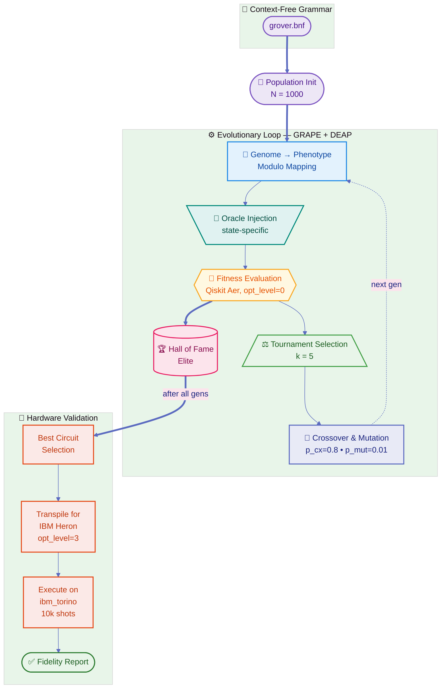
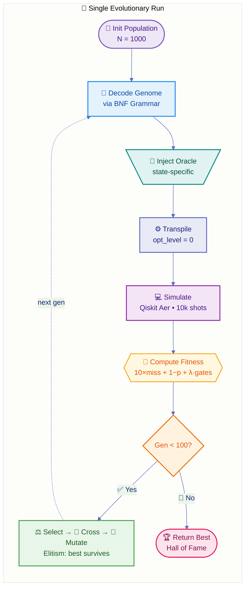
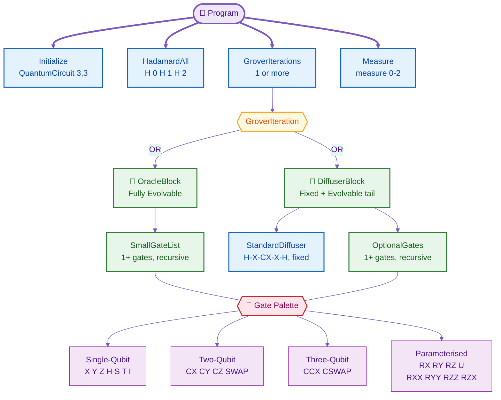
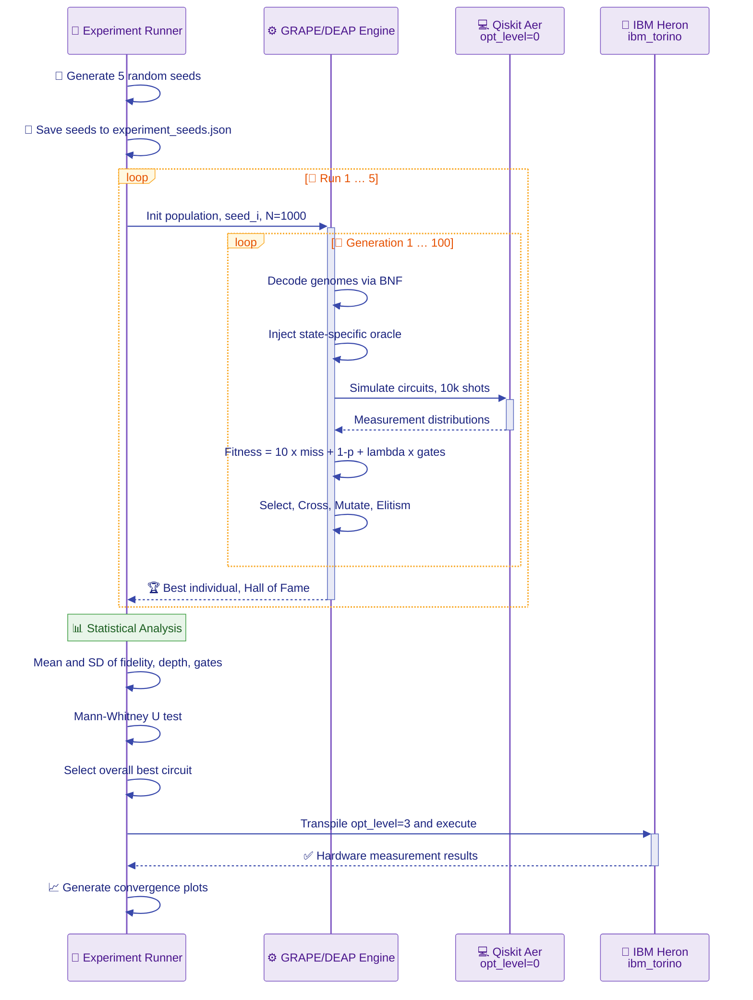

# Evolving Hardware-Efficient Grover Circuits with Grammatical Evolution

> **GECCO '26 Submission** — *Arinze Obidiegwu, Douglas Mota Dias, Emmanuel Obidiegwu*
>
> Automatic synthesis of state-specific, NISQ-optimised, 3-qubit Grover's search circuits via Grammatical Evolution, validated on the 133-qubit IBM Heron processor (`ibm_torino`).

---

## Overview

Classical implementations of Grover's algorithm use a *fixed* oracle + diffuser decomposition that is mathematically optimal on ideal hardware but performs poorly on real Noisy Intermediate-Scale Quantum (NISQ) processors due to decoherence. A canonical Grover circuit for 3 qubits transpiles to a depth of ~140 gates — with an execution time (~80 μs) that approaches the T₂ dephasing limit (~98 μs) of current IBM Heron hardware, leading to inevitable phase randomisation.

This project uses **Grammatical Evolution (GE)** to automatically discover alternative circuit topologies that achieve significantly higher fidelity on actual hardware. The approach follows a **"one-circuit-per-state"** design philosophy: rather than evolving a general oracle, we evolve a *distinct, specialised* circuit for each of the 8 three-qubit target states. This allows the evolutionary process to exploit state-specific mathematical shortcuts (e.g., cancelling adjacent gates, finding non-standard entangling sequences) that are only valid for a particular instance but yield dramatically shallower circuits.

### Key Results

| Target | Canonical Fidelity | Evolved Fidelity | Canonical Depth | Evolved Depth | Depth Reduction |
|:--|:--|:--|:--|:--|:--|
| \|000⟩ | 74.5% | **96.8%** | 145 | 5 | 96.6% |
| \|110⟩ | 66.3% | **96.9%** | 139 | 6 | 95.7% |
| \|111⟩ | 75.3% | **88.4%** | 137 | 24 | 82.5% |

> [!IMPORTANT]
> Evolved circuits achieved fidelities between **88.4% – 96.9%** vs **66.3% – 79.5%** for canonical baselines — an average **93% depth reduction** — all validated on IBM Heron (`ibm_torino`) with 10,000 shots. Results are statistically significant (Mann-Whitney U, p < 0.01).

---

## Architecture

### High-Level System Architecture



### Evolutionary Loop (per Target State)

Each target state runs **5 independent evolutionary experiments**, each with a distinct random seed, to enable statistical analysis. In successful runs, the algorithm maximises fidelity (p_marked ≈ 1.0) within ~20 generations, after which fitness pressure shifts to minimising gate count and depth.



### BNF Grammar Structure

The grammar (`grammars/grover.bnf`) balances the **expressivity-tractability trade-off**: it enforces a *macroscopic bias* (the Grover skeleton) while permitting *microscopic variance* (evolvable internal blocks). This prunes the search space of topologically invalid circuits while allowing GE to discover hardware-efficient decompositions that standard compilers miss.



> [!NOTE]
> The grammar is **more permissive** than the paper's idealised formula `U_total = U_init · (U_diff · U_oracle)^k`. Each `⟨GroverIteration⟩` produces *either* an Oracle *or* a Diffuser block (not both), and `⟨GroverIterations⟩` is a recursive list of one or more such iterations. This means evolution can produce any mixed sequence (e.g., Oracle → Oracle → Diffuser → Oracle), giving it freedom to discover non-standard block orderings.

### Dual-Stage Transpilation Strategy

A critical design decision ensures the evolutionary process learns efficient structures *natively* rather than relying on the compiler:

| Stage | Optimisation Level | Purpose |
|:--|:--|:--|
| **During Evolution** (simulation) | `optimization_level=0` | Disables gate cancellation/commutation — forces GE to discover efficient topologies itself |
| **During Validation** (hardware) | `optimization_level=3` | Full Qiskit optimisation — ensures fair comparison against canonical baselines |

### Fitness Function

Adapted from Spector et al.'s hit-criterion formulation, extended for the NISQ era with a gate-count parsimony term:

```
Fitness(C) = 10 × miss + (1 − p_marked) + λ × gate_count
```

| Term | Definition | Purpose |
|:--|:--|:--|
| `p_marked` | Probability of measuring target state \|w⟩ in noiseless sim | Core correctness metric |
| `miss` | 1 if p_marked < 0.48, else 0 | **Viability gate** — ensures correctness *before* size optimisation |
| `10` | Heavy penalty coefficient on `miss` | Any non-viable circuit always ranks worse than a viable one |
| `λ` | 0.02 (parsimony coefficient) | Penalises gate count to drive depth reduction |

> [!NOTE]
> Fitness is **minimised** (f(C) = 0 is perfect). The `miss` term acts as a phase transition: evolution first achieves viability (p > 0.48), then shifts to structural optimisation. Sensitivity analysis showed λ ≤ 0.01 causes bloat (depth > 50); λ ≥ 0.05 drives populations to trivial empty circuits.

### Experiment Pipeline



---

## Repository Structure

```text
├── grammars/
│   └── grover.bnf                  # BNF grammar for GRAPE
├── Grover_000_STD.ipynb            # GE pipeline for |000⟩
├── Grover_001_STD.ipynb            # GE pipeline for |001⟩
├── Grover_010_STD.ipynb            # GE pipeline for |010⟩
├── Grover_011_STD.ipynb            # GE pipeline for |011⟩
├── Grover_100_STD.ipynb            # GE pipeline for |100⟩
├── Grover_101_STD.ipynb            # GE pipeline for |101⟩
├── Grover_110_STD.ipynb            # GE pipeline for |110⟩
├── Grover_111_STD.ipynb            # GE pipeline for |111⟩
├── grovers-algorithm.ipynb         # Canonical Grover baseline
├── GECCO_2026_QCE_Camera_Ready.pdf # Accompanying paper
└── Readme.md
```

Each `Grover_XXX_STD.ipynb` contains the **complete pipeline** for one target state:

1. **Imports & IBM Backend Config** — Qiskit, GRAPE, DEAP, IBM Runtime
2. **Grammar Loading** — Loads `grammars/grover.bnf` via GRAPE
3. **Oracle Generation** — Creates state-specific oracle code
4. **Circuit Evaluator** — Decodes genomes, injects oracle, builds `QuantumCircuit`, simulates with `optimization_level=0`
5. **Fitness Function** — Three-term fitness with viability gate
6. **GE Hyperparameters** — Population, generations, crossover/mutation, etc.
7. **5 Independent Runs** — Each with a unique random seed
8. **Statistical Analysis** — Mean ± SD of fidelity, depth, gate count
9. **Best Circuit → IBM Hardware** — Transpiled with `optimization_level=3`, executed on `ibm_torino`
10. **Aggregate Visualisation** — Convergence curves across all runs

---

## GE Hyperparameters

| Parameter | Value | Note |
|:--|:--|:--|
| Population Size | 1 000 | |
| Generations | 100 | Fidelity converges ~gen 20; depth reduces thereafter |
| Selection | Tournament (k = 5) | |
| Crossover Rate | 0.80 | |
| Mutation Rate | 0.01 | Integer mutation |
| Elitism | 1 | Best individual survives each generation |
| Codon Size | 400 | |
| Max Tree Depth | 50 | |
| Init Depth Range | 20 – 40 | |
| Codon Consumption | Lazy | |
| Independent Runs | 5 | Per target state |
| Shots | 10 000 | Per simulation / hardware execution |

---

## Prerequisites

**Python 3.8+** with Jupyter.

```bash
pip install qiskit qiskit-aer qiskit-ibm-runtime deap grape-bds numpy pandas matplotlib jupyterlab
```

> [!IMPORTANT]
> Ensure the `grape-bds` library (GRAPE: Grammatical Algorithms in Python for Evolution) is installed and on your Python path.

---

## How to Run

1. **Clone** the repository.
2. **Launch Jupyter:**
   ```bash
   jupyter lab
   ```
3. **Open** the notebook for the desired target state (e.g., `Grover_000_STD.ipynb`).
4. **Run all cells.** The notebook will:
   - Load the BNF grammar
   - Initialise a GRAPE/DEAP population
   - Execute 5 independent evolutionary runs (100 generations each)
   - Output statistical results and convergence plots
   - *(Optionally)* Submit the best circuit to IBM quantum hardware

---

## Hardware Execution

Results reported in the paper were obtained on the **IBM Heron (`ibm_torino`)** 133-qubit processor during a specific calibration window (T₁ ≈ 146 μs, T₂ ≈ 98 μs).

To reproduce hardware validation:

1. Obtain a valid [IBM Quantum](https://quantum.ibm.com/) account.
2. Set your API token securely — do **not** commit tokens to version control.
3. Update the backend configuration in the notebook.

> [!WARNING]
> The notebooks contain placeholder tokens (`IBM_QUANTUM_TOKEN_HERE`). You must replace these with your own credentials before hardware execution.

---

## Grammar Details

The BNF grammar enforces a rigid **macro-structure** while leaving **micro-structure** fully evolvable:

```
U_total = U_init · (U_diff · U_oracle)^k
```

- **Fixed skeleton:** `⟨Program⟩ ::= ⟨Initialize⟩ ⟨HadamardAll⟩ ⟨GroverIterations⟩ ⟨Measure⟩`
- **Evolvable Oracle:** Can contain any sequence from the gate palette `{X, Y, Z, H, S, S†, T, T†, I, CX, CY, CZ, SWAP, CCX, CSWAP, RX, RY, RZ, U, RXX, RYY, RZZ, RZX}` with discrete angles `{0, π/4, π/2, π, 3π/2, 2π, 0.5, 1.3, 2.7, 0.314, 1.5708, 3.1415}`.
- **Evolvable Diffuser tail:** The diffuser starts with a fixed H-X-CX-X-H scaffold, followed by an evolvable gate sequence.

GE's **modulo-based mapping** (`r = c_i mod R`) decouples search-space dimensionality from solution complexity. The **wrapping operator** introduces non-locality: a mutation at codon c_k alters the modulus context for all subsequent codons, enabling large topological jumps (exploration) rather than mere parameter tuning (exploitation).

---

## Reproducibility Notes

- **Stochastic Process:** GE is inherently stochastic. Each run produces different circuits. The 5-run experimental design with seed logging enables statistical analysis.
- **Seed Logging:** Seeds are saved to `experiment_seeds.json` for exact reproducibility.
- **Hardware Noise:** Real quantum hardware calibration (T₁, T₂, readout error) fluctuates daily, so hardware fidelity may vary.
- **Statistical Validation:** Results validated via Mann-Whitney U test (p < 0.01 for all states with Hamming weight ≤ 2). Cohen's d > 2.0 indicates extremely large effect sizes.

---

## Future Directions

- **Lexicase / Lexi2 Selection** — Eliminate manual λ tuning via multi-objective selection
- **Noise-Aware Simulation** — Incorporate device-specific noise models into fitness evaluation
- **Hybrid Optimisation** — Combine GE structural search with gradient-based parameter fine-tuning
- **Intrinsic Evolution** — Evaluate fitness directly on the QPU, allowing evolution to exploit device-specific physics